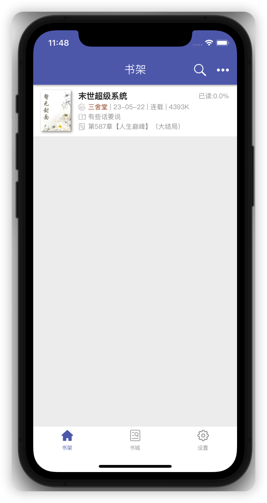
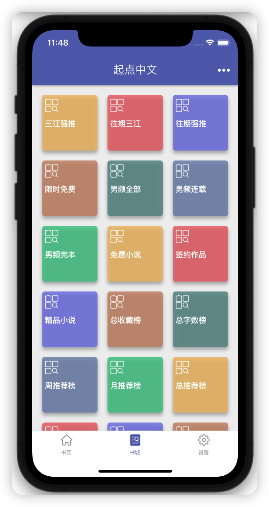
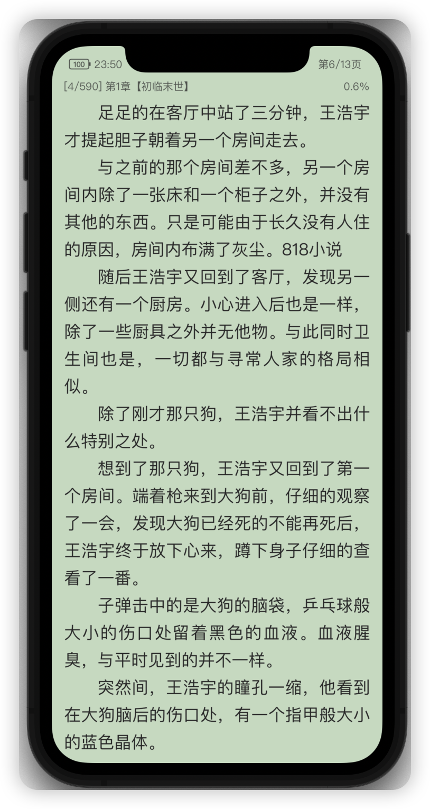
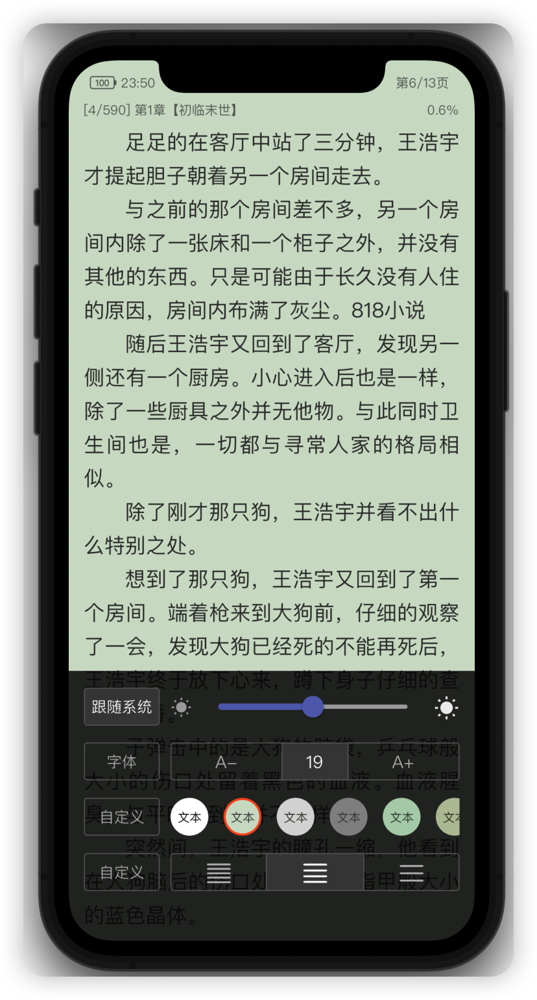

<h1 align="center">

BookReader
</h1>

    <em>基于Flutter开发的小说阅读器，支持Android开源阅读2.0版本的书源，不支持3.0书源。</em>

## BookReader界面

<table>
<tr>
<td>

</td>
<td>

</td>
<td>

</td>
</tr>
<tr>
<td>

</td>
<td>

</td>
<td>

</td>
</tr>
</table>

## 本地阅读器推荐

## License

[GNU General Public License v3.0](./LICENSE)
